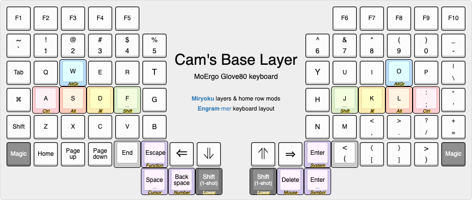

# MoErgo Glove80 Custom Configuration for ZMK

This is my custom keyboard configuration for my Glove80. It is basically a fork of the [Sunaku Glorious Engrammer](https://github.com/sunaku/glove80-keymaps) keymap, with a couple of changes specific to me.

Overall changes:
- Removal of symbol and emoji and world layers
- Some changes of the keymap on the thumb cluster
- Use QWERTY by default, remove other keymaps

I came from the Ergodox and am heavily influenced by the default keymap layout of the Ergodox.

## Legend

## Resources
- The [official MoErgo Glove80 Support](https://moergo.com/glove80-support) web site. Glove80 documentation and other technical resources.
- The [official MoErgo Discord Server](https://moergo.com/discord). Instant conversations with other Glove80 users.

- The [official ZMK Documentation](https://zmk.dev/docs) web site. Find the answers to many of your questions about ZMK Firmware.
- The [official ZMK Discord Server](https://discord.gg/8cfMkQksSB). Instant conversations with other ZMK developers and users. Great technical resource!

- The [official Glove80 ZMK Distribution](https://github.com/moergo-sc/zmk). Repositiory for ZMK firmware customized for Glove80. 
 
## Firmware Files
1. Download the glove80.uf2 from the Github Action of any build that you want
2. Flash the firmware to Glove80 according to the user documentation on the official Glove80 Glove80 Support website (linked above)

Your keyboard is now ready to use.
